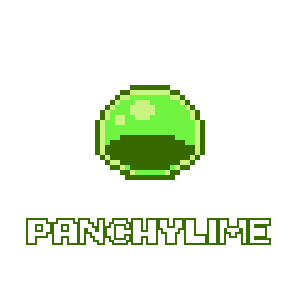
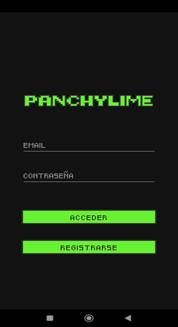
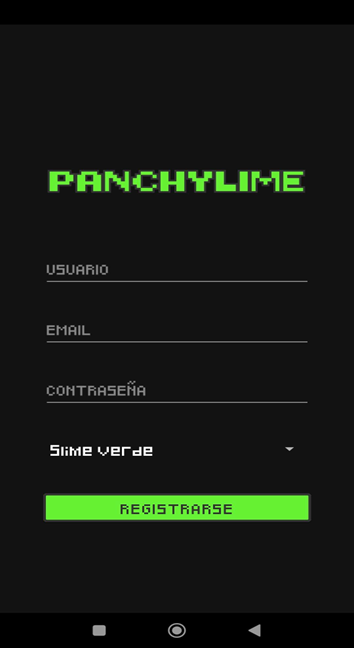
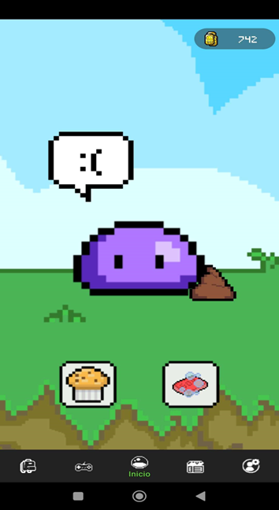
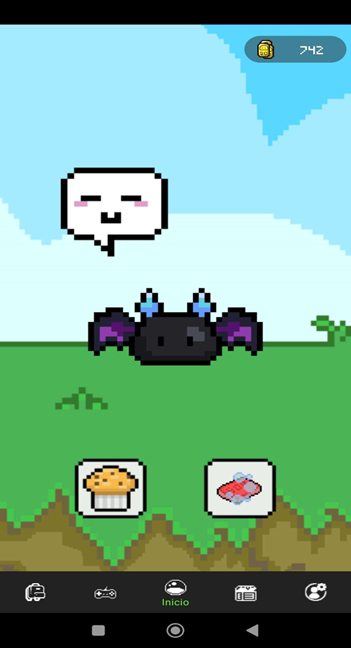
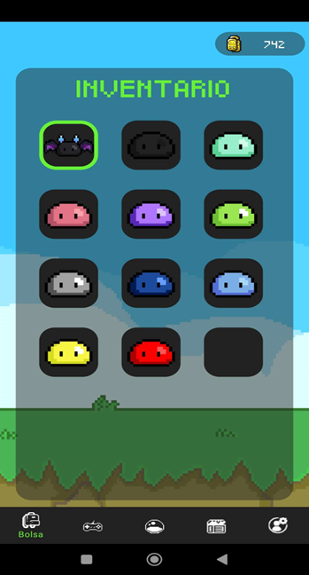
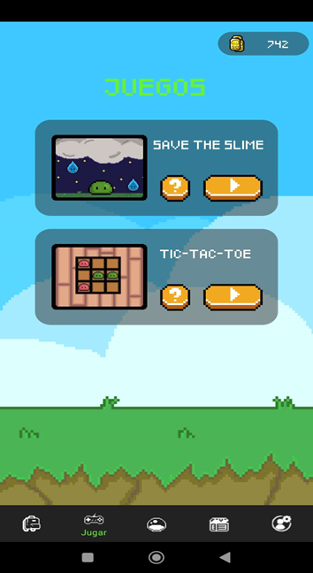
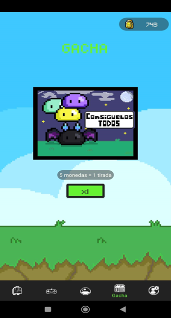
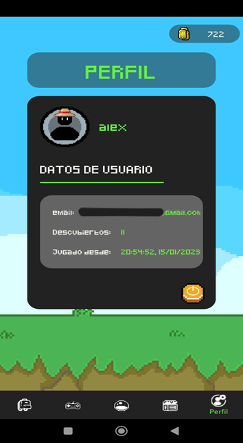

# PANCHYLIME APP

> Developed by Draco0503 and Jaekwin

This project was made for the subject of Multimedia and Mobile Devices Programming. The IDE used is Android Studio and it uses Firebase Services such as Auth, Storage and Realtime Database. Its in Spanish and in English.

This app its almost 97% full custom, the designs and the styles are made by us.

Here are some of the screens that the game has:

## Login and Register

    
    

### INITIAL PETS 

    
    
    

  

## Index Screen

    
    

  

## Bag and Play Screens

    
    

  

## Gacha and Users Account Screens

    
    

